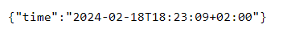

# Lab 1 - Git and HTTP
## Group: IM-22
### First Lab on Software Engineering Components

---

**In this project we have developed an HTTP server, which returns a json response with current time.**

### Contributors:

-
- Maxim Sachko sachko.maxim@lll.kpi.ua (or maks07sim@gmail.com)


### How to use:

1. Open terminal & clone repo to your pc:
```bash
git clone https://github.com/KPI-team-labs/git-and-http.git
```
2. Go to your local repo directory:
```bash
cd git-and-http/
```
3. Run local server:
```bash
go run time.go
```
4. Follow this link http://localhost:8795/time:


